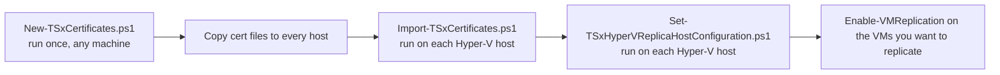

# Configure Hyper-V Replica over HTTPS

This folder contains three PowerShell scripts that together let you set up **Hyper-V Replica**
between two (or more) Hyper-V hosts using **HTTPS with certificate-based authentication**,
instead of the default Kerberos-over-HTTP option.

This guide assumes you have never done this before and explains what each script does,
in what order to run them, and why.

## Why HTTPS instead of HTTP?

Hyper-V Replica can authenticate replication traffic in two ways:

- **Kerberos (HTTP, port 80)** – simplest, but traffic is not encrypted and both hosts must be
  domain members that can authenticate each other directly (does not work well across
  untrusted domains, workgroups, or over the internet).
- **Certificate-based (HTTPS, port 443)** – traffic is encrypted, and it works between hosts
  that are not in the same domain (or not domain-joined at all), as long as both hosts trust
  the same certificate.

These scripts implement the certificate-based (HTTPS) option using **self-signed certificates**,
which is a good fit for labs, small environments, or when you don't have an internal
Certificate Authority (CA) available.

## What you need before you start

- Two or more Hyper-V hosts (Windows Server 2016 or later, or a recent Windows 10/11 machine
  with the Hyper-V role) that will replicate VMs to each other.
- Local Administrator rights on all the hosts involved.
- A shared folder or removable media to move certificate files between machines (the
  certificates are created on one machine and then copied to every Hyper-V host).
- PowerShell run **elevated** ("Run as Administrator") on every host.

## The scripts, in the order you use them

### 1. `New-TSxCertificates.ps1` — create the certificates

Run this **once**, on any machine (it does not have to be one of the Hyper-V hosts).

It creates:

- A self-signed **Root CA certificate** that will be trusted by all your Hyper-V hosts.
- One **certificate per Hyper-V host** you list, signed by that Root CA, valid for both
  server and client authentication (needed because in Hyper-V Replica, hosts can be both a
  replication source and a destination).

All certificates are exported as files into the folder you specify with `-Path`, and then
removed from the local machine again (so nothing stays behind on the machine that generated
them).

```powershell
$Password = Read-Host -AsSecureString -Prompt 'PFX password'

.\New-TSxCertificates.ps1 `
    -Computers 'hv01.corp.contoso.com', 'hv02.corp.contoso.com' `
    -Path C:\Certs `
    -Password $Password `
    -RootCommonName 'Contoso Hyper-V Replica Root CA'
```

Use the **fully qualified domain name (FQDN)** of each host in `-Computers` if the hosts are
domain-joined and reachable by FQDN — this is what Hyper-V Replica will look for when
matching the certificate to the host.

After it finishes, `C:\Certs` will contain:

- `RootCA.cer` / `RootCA.pfx` — the Root CA public certificate and key pair.
- `<hostname>.pfx` / `<hostname>.cer` — one pair per host you listed.

Keep the PFX password safe — you need it again in step 2.

### 2. `Import-TSxCertificates.ps1` — install the certificates on each host

Copy the `C:\Certs` folder (or just the relevant files) to **every Hyper-V host**, then run
this script **on each host**, elevated:

```powershell
.\Import-TSxCertificates.ps1 -Path C:\Certs -Password $Password
```

This script:

- Imports `RootCA.cer` into **Trusted Root Certification Authorities (Local Computer)**, so
  the host trusts certificates signed by it.
- Finds the `.pfx` file that matches the current computer name (or FQDN) and imports it into
  **Personal (Local Computer)**, including its private key.

Run it once per host — it automatically picks the right `<hostname>.pfx` file for the machine
it's running on, as long as that file is present in the folder you point `-Path` to.

### 3. `Set-TSxHyperVReplicaHostConfiguration.ps1` — configure Hyper-V Replica

Run this **on each Hyper-V host** (or remotely against several hosts at once using
`-ComputerName`) after the certificates have been imported:

```powershell
.\Set-TSxHyperVReplicaHostConfiguration.ps1 -ComputerName 'hv01.corp.contoso.com','hv02.corp.contoso.com' -Verbose
```

This script:

- Disables the certificate **revocation check** for Hyper-V Replica. Self-signed certificates
  have no revocation list (CRL), so without this setting Hyper-V Replica would refuse to use
  them.
- Enables the built-in inbound firewall rules for the Hyper-V Replica listeners (**TCP 80** and
  **TCP 443**).
- Enables the host as a **Hyper-V Replica server** using **certificate-based authentication**,
  automatically selecting the certificate that was imported in step 2 (matched by host name).

To later turn this off again on a host, run the same script with `-Disable`.

## Typical end-to-end flow



## Notes and tips

- All three scripts support `-WhatIf` and `-Verbose`, so you can preview what they would do
  before making changes.
- After running `Set-TSxHyperVReplicaHostConfiguration.ps1`, it's recommended to restart the
  **Hyper-V Virtual Machine Management service (vmms)** on the host for the setting to fully
  take effect.
- Once both hosts are configured, use `Enable-VMReplication` (or the Hyper-V Manager UI) on
  the source host to start replicating individual virtual machines to the destination host —
  these scripts only prepare the hosts, they do not configure replication for specific VMs.
- If replication fails with a certificate/trust error, double check that the **same Root CA**
  (`RootCA.cer`) was imported on **all** hosts, and that each host has its own matching
  `<hostname>.pfx` imported into `Cert:\LocalMachine\My`.
